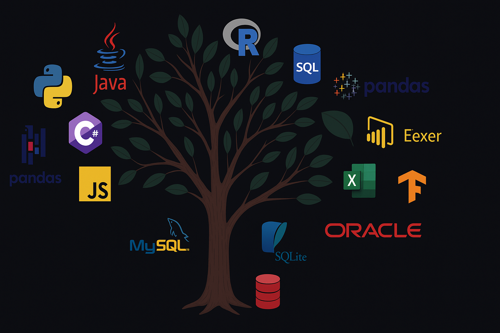

<!-- Encabezado animado -->

<!-- # Hi there, I'm [Mateo Orozco Baldovino](mateoorozcobaldovino.netlify.app) 👋

Data Analyst, specializing in **Data Analysis**, **automation**, and **Python-based solutions**.  
Skilled in applied statistics for data-driven insights.
 

---

## 🔎 About Me
- 🔭 Currently developing projects with **Python + R + SQL + Power BI**
- 🌱 Learning **data pipelines** and **basic Machine Learning**
- 🤝 Interested in collaborating on data analysis, dashboards, and automation projects
- 💬 Let's talk about exploratory data analysis, visualization, or simple statistical modeling
- 📫 Contact: **mateob-1097@hotmail.com**
- 🌐 Portfolio: [mateoorozcobaldovino.netlify.app](https://mateoorozcobaldovino.netlify.app/)

---

## 🌐 Connect with Me

 

-->
---

## 🧠 Technologies and Tools

Throughout my journey, I have explored these tools at different levels of depth, and I continue to expand my knowledge day by day.

### 🔹 Languages

##### Primarily Python, Java, and JavaScript

### 🔹 Databases

##### Primarily MySQL, PostgreSQL and SQL Server

     

### 🔹 Analysis and Visualization Tools

##### I usually use Excel and Power Bi

   

### 🔹 Development and Version Control

##### I can use any of these tools depending on the project, but my favories are Visual Studio Code, RStudio, Google Colab, Git, Pycharm and NetBeans.

         

### 🔹 Other Tools

##### I have the ability to use different platforms to make life easier during the project.

         

---

## 📊 Estadísticas de GitHub

  

---

  

  <i>Thank you for visiting my profile! Feel free to contact me if you want to collaborate on any project.</i>

